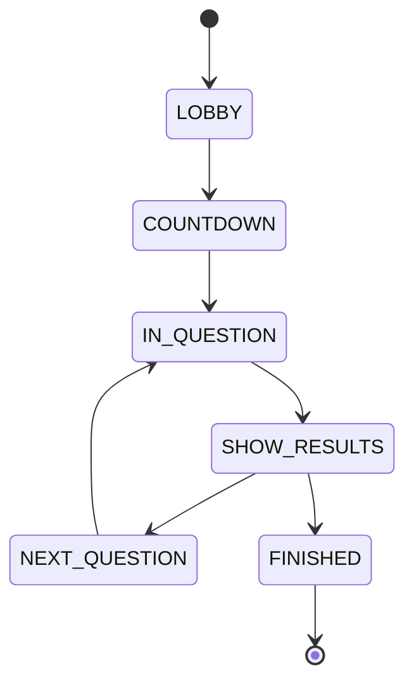
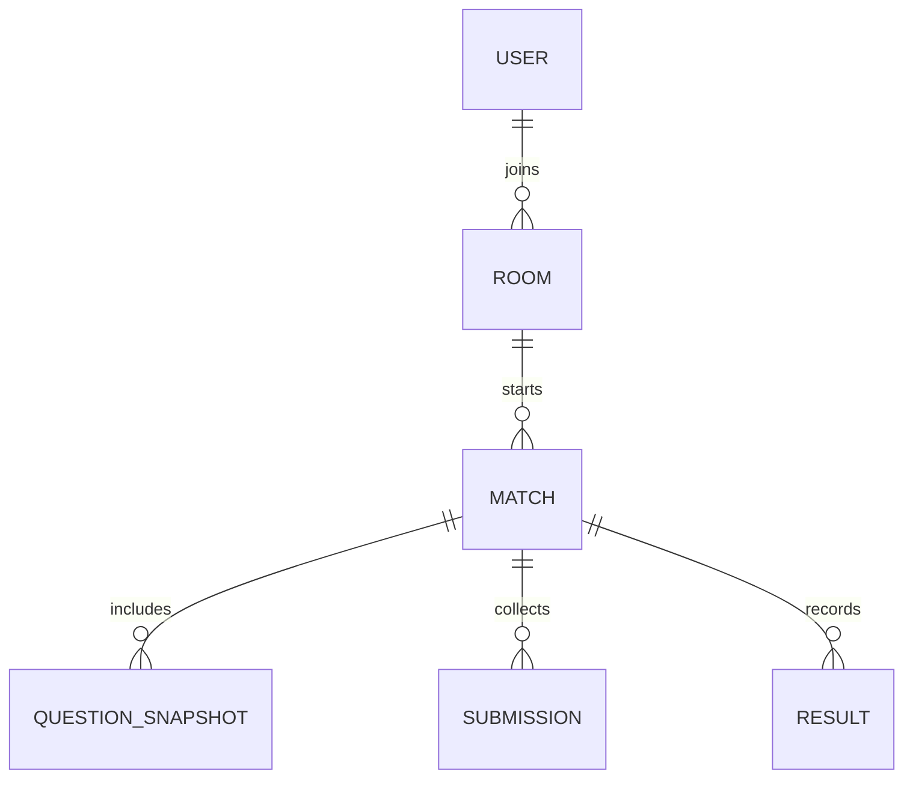
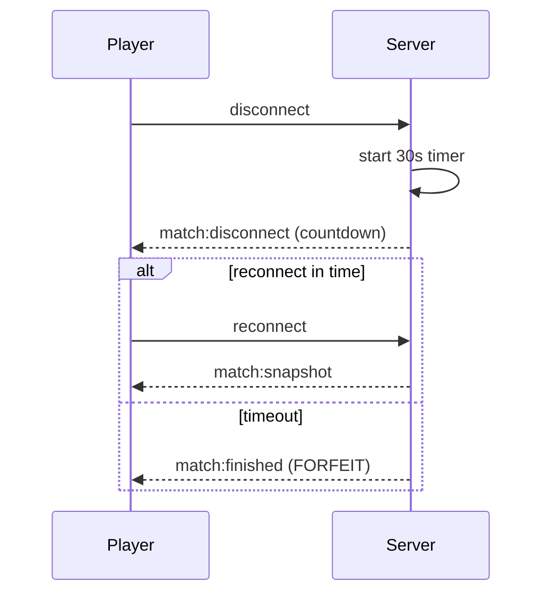

# Architecture Overview

## System Context

QuizDuel is a MERN monorepo with a React client and an Express + Socket.IO server. MongoDB stores users, rooms, and matches (question snapshots, submissions, and results). Ollama is optional for essay judging.

## Auth + JWT

- Username/password auth with bcrypt hashing.
- JWT access tokens secure REST and Socket.IO connections.
- JWT allows stateless verification for both HTTP and real-time channels.

## State Machine

## Data Model Diagram

## Reconnect + Forfeit Sequence

## Wikidata Question Generation

- Server pulls facts from Wikidata via SPARQL.
- Deterministic templates convert facts into MCQs.
- Wikipedia summary endpoint provides evidence snippets; if not available, the fact is discarded.
- Citations stored as URL + short snippet only.

## Extending Providers

Implement the `QuestionProvider` interface and register it in `questionService.js`.
